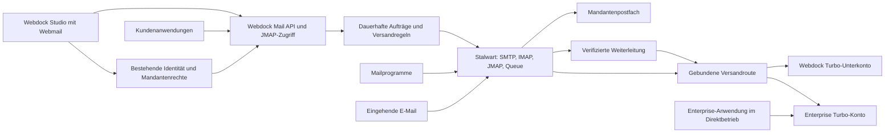

# Webdock Mail: native Versandplattform, Postfächer und Webmail

Stand: 10. Oktober 2026. Umsetzung autorisiert; noch kein Bericht über ausgerollte Funktionen. Verbindlich ist die [CE-Deploymententscheidung](../../architecture/mail-deployment-decision.md): eine isolierte Instanz pro Mandant mit aktiviertem E-Mail-Dienst.

## 1. Ziel und verbindlicher Umfang

Webdock erhält ein eigenes Produkt **Webdock Mail**. Die vorhandene Relaykit-Implementierung dient als fachliche und technische Grundlage. Es gibt für neue Kunden weder ein separates Relaykit-Produkt noch eine zweite Anmeldung oder Organisation.

Vom Auftrag vorgegeben:

- Normale Kunden nutzen verpflichtend die Webdock-Mail-Funktionen und den von Webdock betriebenen Versand. Sie erhalten keine Turbo-Zugangsdaten und benötigen kein Turbo-Konto.
- Enterprise-Kunden können ihr eigenes Turbo-Konto verbinden. Die Webdock-Versandplattform ist für sie optional.
- Stalwart soll die Grundlage für Mailserver, Postfächer und Empfang werden. Turbo bleibt der nachgeschaltete Dienst für ausgehende externe Zustellung.
- Kunden können eigene Postfächer oder reine Weiterleitungen verwenden.
- **Webmail gehört in den ersten Kundenrelease:** Kunden lesen und beantworten ihre E-Mails unmittelbar in Webdock.
- Dieser Auftrag liefert Konzept und Umsetzungsfahrplan. Er provisioniert keine Infrastruktur und verändert weder DNS noch laufende Mailkonten.

Gewählte Architektur: getrennte Stalwart-CE-Instanz pro Mandant mit aktiviertem E-Mail-Dienst. Webdock betreibt die Infrastruktur; Spitzli erhält bei Aktivierung seine eigene Instanz. Native Webmail auf JMAP und vorhandenes Better Auth bleiben vorgesehen. Die frühere Empfehlung einer gemeinsamen Enterprise-Installation ist damit ersetzt.

Die anschließend angefragte Prüfung der übrigen Stalwart-Spezifikationen ist in der [Funktions- und Protokollmatrix](../../architecture/stalwart-capabilities.md) dokumentiert. CalDAV, CardDAV, JMAP-Kalender/-Kontakte, WebDAV-Dateien, Freigaben und automatische Benachrichtigungen werden im Fundament berücksichtigt. Native Kalender-/Kontakteoberflächen sind eine empfohlene nächste Erweiterung; Webmail bleibt verbindlich im ersten Release.

## 2. Befund aus den vorhandenen Projekten

### Webdock

Der aktuelle Stand besitzt bereits Kunden/Mandanten, Better Auth, Studio-Delegation, Mailverwaltung, Domainbesitzprüfung und Turbo-Unterkonten. Wesentliche Stellen:

| Datei | Heute | Konsequenz |
| --- | --- | --- |
| `apps/auth/src/lib/tenant-mail.ts` | Ein Turbo-Unterkonto je Kunde, Provisionierung und Quoten | Bestehende Zuordnung erhalten; Dienststatus künftig vom Transport trennen |
| `apps/auth/src/lib/mail-keys.ts` | Erstellt echte Turbo-Consumer-Schlüssel; liefert Turbo-SMTP/API-Hosts | Für Managed-Kunden durch Webdock-Schlüssel ersetzen; alte Schlüssel kontrolliert widerrufen |
| `apps/auth/src/lib/mail-domains.ts`, `mail-dns.ts` | Öffentliche TXT-Besitzprüfung, Provider-Domainstatus | Besitzprüfung weiterverwenden; Empfang, eigene DKIM-Schlüssel und Transportstatus ergänzen |
| `apps/auth/src/lib/mail-tracking.ts` | Provider-Tracking einschließlich `smtptrack.com` | Keine automatische Übernahme in normale Kundensichten |
| `apps/auth/src/lib/studio-api.ts` | Aktuelle Autorisierung hinter Studio-RPC | Für Mailverwaltung nutzen; keine universelle Postfach-Leseberechtigung daraus ableiten |
| `apps/admin/src/lib/studio-client.ts` | Delegierte Aufrufe, begrenzte JSON-Größen | Gut für Konfiguration; kein Transport für große MIME-Nachrichten/Anhänge |
| `apps/auth/src/lib/plans.ts` | Allokationen, u. a. `mailMessages` | Nicht als bereits durchgesetztes Mailbudget behandeln |
| `apps/auth/src/lib/mail.ts` | Plattform-/Authentifizierungsmails | Eigenen Systemversand behalten, getrennt von Kundensperren |

Die aktuelle Mail-Oberfläche liegt in `apps/admin/src/app/(console)/(portal)/tenants/[customerID]/mail/`; ältere Auth-Seiten und deren Aktionen müssen beim Umbau ebenfalls abgesichert werden. Reines Ausblenden in Studio verhindert keinen Zugriff auf bestehende Endpunkte.

Die bestehenden Architekturdateien `docs/architecture/platform-mail.md` und `plans-and-storage.md` beschreiben den alten Zustand. Dieses Konzept ersetzt ihn erst mit der tatsächlichen Migration.

### Relaykit

Untersuchte Grundlage: `/home/newt/Projects/Personal/turboSMTP/relaykit/`, insbesondere README, Handover, Schema und Versand-/Eventlogik.

Übernehmen und auf Webdock-Mandanten umstellen:

- Domainbeschränkte, gehashte API-Schlüssel und einmalige Secret-Anzeige.
- Validierung von Nachrichten, geplante Sendungen, Batches und Simulator.
- Idempotenz, dauerhafte Nachrichten-IDs und vorsichtige Behandlung unklarer Versandübergaben.
- Zustellereignisse, Suppressions, signierte Kunden-Webhooks mit Retry/Lease und SSRF-Schutz.
- Reduzierte Logs, Quickstart und OpenAPI-Vertrag.

Gezielt ersetzen:

- Neon-Auth-/`user_id`-Ressourcenmodell durch vorhandenes Webdock-`customer_id` und explizite Berechtigungen.
- Direkten `mailer().send()`-Aufruf an Turbo durch Übergabe an Stalwart.
- Provider-Domain-ID als fachlichen Primärschlüssel durch eigene Webdock-ID.
- UUIDs für neue Plattformobjekte durch bestehende Snowflake-IDs als Dezimalstrings; Alt-IDs als Referenzen behalten.
- Den globalen Statusrang einer E-Mail durch Status **je Empfänger** plus abgeleitete Zusammenfassung. Ein Bounce bei B darf eine erfolgreiche Zustellung bei A nicht verdecken.
- Klartext gespeicherte Webhook-Signing-Secrets durch verschlüsselte Secrets.
- Historisch unbegrenzte Aufbewahrung von Nachrichteninhalten durch explizite Aufbewahrungsregeln.

Nicht unverändert kopieren: Relaykits Sonderfall, der bei vollständig unterdrücktem `to` auch gültige `cc`/`bcc` überspringt. SMTP-Envelope-Empfänger sind die Wahrheit; Bcc-only-Versand muss korrekt funktionieren.

## 3. Architekturentscheidung und Alternativen

| Variante | Vorteile | Nachteile | Bewertung |
| --- | --- | --- | --- |
| Gemeinsames Stalwart Enterprise, Webdock davor | Native Mandanten, zentrale Administration, Postfächer und gemeinsame Betriebsabläufe | Laufende Lizenz, gemeinsamer Ausfallbereich | Alternative für einen späteren Wechsel |
| Stalwart Community je aktiviertem Mandant | Isolation durch getrennte Instanzen/Stores, keine Enterprise-Mandantenfunktion nötig | Mehr Instanzen, Routing, Updates, Backups und Ressourcen | **Vom Nutzer gewählt** |
| Relaykit direkt an Turbo, zusätzlicher Postfachdienst | Schnellster Weg zur bisherigen Versand-API | Zwei unterschiedliche Mailpfade, doppelte Regeln, kein durchgängiges Stalwart-Fundament | Erfüllt das gewünschte Ziel schlechter |

Stalwarts eingebaute Mandantentrennung ist ausdrücklich Enterprise-exklusiv. Mehrere Domains in einer gemeinsamen Community-Installation sind kein Ersatz für diese Sicherheitsgrenze. [Stalwart: Tenants](https://stalw.art/docs/auth/authorization/tenants/)

Die aktuelle Enterprise-Lizenz beschreibt kommerziellen Betrieb für externe Organisationen; die Lizenzgröße hängt von provisionierten Benutzer- und Gruppenaccounts ab. Technische Versandaccounts und gemeinsame Postfächer müssen deshalb in die Kalkulation einfließen. Konkrete Einstufung, Preis und Nutzungsbedingungen werden vor Beschaffung bestätigt. [Enterprise-Lizenz](https://github.com/stalwartlabs/stalwart/blob/main/LICENSES/LicenseRef-SEL.txt), [Editionen](https://stalw.art/compare/)

### Wem gehört der Server?

Der Maildienst wird als **Webdock-Plattformressource** geführt, mit Webdock-Hostnamen, Betriebsschlüsseln und Backup-Verantwortung. Der Vertrag/Rechnungsinhaber kann Spitzli Development sein. Daraus folgt aber keine Adminberechtigung für gewöhnliche Mitglieder des Spitzli-Kundenmandanten.

Webdock-Systemmails, Spitzli und jeder externe Kunde erhalten getrennte Zuordnungen. Das Löschen oder Sperren des Spitzli-Mandanten darf die Plattforminfrastruktur nicht löschen oder abschalten. Kein Kundenmandant erhält die Stalwart-Serveradministration.

Stalwart unterstützt lokale Zustellung, MX-Zustellung und authentifizierte Relay-Routen. Webdock nutzt diese bestehenden Fähigkeiten; es entwickelt keinen eigenen SMTP-/IMAP-Server. [Routing](https://stalw.art/docs/mta/outbound/routing/)

## 4. Produktmodell: Versand und Empfang sind unabhängig

### Versandprofile

| Profil | Zugang des Kunden | Externe Versandroute | Webdock-Funktionen |
| --- | --- | --- | --- |
| `managed` | Webdock-API bzw. Webdock-SMTP | Stalwart → Webdock-Turbo-Unterkonto dieses Mandanten | Verpflichtend, voller verwalteter Funktionsumfang |
| `byok_gateway` | Webdock-API bzw. Webdock-SMTP | Stalwart → kundeneigenes Turbo | Native Funktionen; Turbo-Verbrauch auf Kundenkonto |
| `byok_direct` | Eigene Turbo-API/SMTP des Kunden | Kundenanwendung → eigenes Turbo | Webdock-Versand-API optional abgewählt; keine Vollständigkeitszusage für fremden Direktverkehr |

`byok_gateway` und `byok_direct` setzen eine serverseitige Berechtigung `mail.byok` voraus. Ein frei editierbarer Planname „Enterprise“ genügt nicht. Eine zusätzliche Berechtigung `mail.direct_transport` erlaubt den Direktbetrieb.

Wichtig: `byok_direct` beschreibt die Integration eigener Anwendungen. Nutzt derselbe Kunde Webdock-Postfächer/Webmail, laufen deren Nachrichten weiterhin durch Stalwart und seine eigene Turbo-Route. Die Regeln unseres Postfachdienstes lassen sich damit nicht umgehen.

Managed-Kunden dürfen SMTP für WordPress, Geräte und andere Anwendungen verwenden. Der Host heißt beispielsweise `smtp.mail.webdock.dev`; die Zugangsdaten gelten ausschließlich dort. Native Mailregeln gelten für SMTP ebenso wie für die API. Das erfüllt die Pflicht zur Webdock-Plattform ohne jede Anwendung zu einem REST-Umbau zu zwingen.

### Empfangsprofile je Domain, Zustellziele je Adresse

- `external`: Der Kunde behält z. B. Microsoft 365 oder Google Workspace. Webdock darf von verifizierten Adressen senden; MX bleibt extern.
- `hosted`: Webdock ist für den Empfang der Domain zuständig. Jede Adresse kann ein Postfach, einen lokalen Alias, eine externe Weiterleitung oder Postfach plus Weiterleitung haben.
- `send_only`: Nur Versand ist eingerichtet; daraus entsteht keine Empfangszusage und kein automatischer MX-Wechsel.

„Nur Weiterleitung“ ist ein `hosted`-Empfang ohne für den Kunden sichtbaren Nachrichtenspeicher. Ein rein technischer Routing-Account kann je nach Stalwart-Modell erforderlich sein; er wird ohne Login und ohne nutzbares Postfach provisioniert, und seine Lizenzkosten werden geprüft.

Beispiel für denselben Mandanten: `anna@firma.de` ist ein persönliches Postfach, `info@firma.de` ein freigegebenes Team-Postfach, `rechnung@firma.de` eine Weiterleitung an die Buchhaltung, `noreply@send.firma.de` eine reine Versandidentität.

## 5. Laufzeiten und Datenhoheit

### Bestehendes Webdock

`apps/auth` bleibt maßgeblich für Benutzer, Mitgliedschaften, Plattformrollen, Vertragsrechte und bestehende Kundenbeziehungen. `apps/admin` enthält die Oberfläche einschließlich Webmail. Mailverwaltung nutzt den vorhandenen Studio-Delegationsweg.

### Neuer schlanker Maildienst

`apps/mail` wird ein dauerhaft laufender Node-24-Dienst neben Stalwart, mit HTTP-API und einem getrennt startbaren Worker aus derselben Codebasis. Er benötigt keine eigene Benutzerverwaltung und keinen eigenen Login.

Er übernimmt API-Key-Authentifizierung, Versandaufträge, Zeitplanung, Webhooks, Eventannahme, Stalwart-Anbindung und den begrenzten JMAP-Zugriff für Webmail. PostgreSQL-Aufträge mit atomarer Reservierung/Lease genügen zunächst; kein zusätzlicher Redis-, Kafka- oder Workflow-Stack.

Warum eine eigene Laufzeit: SMTP, große Anhänge, laufende Worker und kurzfristige MTA-Regelprüfungen passen nicht in die vorhandenen kleinen Studio-JSON-Aufrufe. Im aktuellen Code sind Requests auf 128 KiB und Antworten auf 2 MB begrenzt. Diese Limits werden nicht global aufgeweitet.

Für Browserzugriff stellt Auth einen kurzen, einmalig einlösbaren Mail-Session-Austausch aus. Die Mail-Session bleibt serverseitig an echte Webdock-Session, Benutzer, Mandant und erlaubte Postfächer gebunden. Aktuelle Rechte werden am Auth-Service geprüft; CORS/CSRF und feste erlaubte Origins gelten. Weder native Auth-Cookies noch administrative Mailtokens werden an andere Dienste oder den Browser weitergereicht. Große Uploads/Downloads laufen über Mail-Endpunkte mit dafür ausgestellten, kurzlebigen, kontogebundenen Berechtigungen.

### Stalwart und Speicher

Stalwart besitzt Mailboxen, MIME-Inhalte, Ordner, Entwürfe, Lesestatus, Suche, Protokollsessions und seine Zustellqueue. Bei Freischaltung besitzt es außerdem Kalender, Kontakte und private Dateien; JMAP und DAV arbeiten auf demselben Bestand. PostgreSQL in `webdock_mail` besitzt Produktkonfiguration, Aufträge, Versandmetadaten, Ereignisse und Abrechnung. Keine zweite Kopie aller Posteingänge oder Kalender in Webdock SQL.

Eigene DB-Rollen für Mail-API/Worker und Provisionierung; kein Zugriff auf Better-Auth-Passworthashes. Ein privater Blobstore hält nur vorübergehende API-Payloads und Uploads. Der bisherige öffentliche CMS-Blobstore ist dafür ungeeignet.

Der initiale Stalwart-Pilot kann eine persistente VM mit lokalem Store und verschlüsseltem externem Backup nutzen. Vor allgemeinem Kundenbetrieb werden Last, Store-Auswahl und Wiederherstellung gemessen. Eine einzelne VM ist kein hochverfügbarer Cluster; ein zusätzlicher MX-Name auf derselben Maschine schafft keine Redundanz. Keine ungetestete Active/Active-Konfiguration auf gemeinsamem Dateivolume.

## 6. Gemeinsame Versandregeln und sichere Routen

### Gleiche Prüfung für alle Zugänge

API, Webmail und SMTP müssen dieselben Regeln erfüllen: aktiver Dienst, berechtigter Absender, Domainbesitz, wirksame Route, Budget, Rate-Limit, Nachrichtengröße und Suppressions. Von Benutzern gesetzte `X-Webdock-*`-Header werden nicht als Identität akzeptiert.

Für SMTP werden die Regeln am Stalwart-Eingang kontrolliert. Nicht nur `MAIL FROM`, sondern auch der sichtbare `From`-Header und erlaubte Send-as-Adressen sind zu prüfen. Die dokumentierte Envelope-Prüfung allein deckt den Header nicht ab. [Stalwart-Entwickler zur Senderprüfung](https://support.stalw.art/t/stalwart-allows-any-mail-to-be-the-sender/1598)

Stalwart-MTA-Hooks können HTTP-basierte Prüfungen am SMTP-Eingang ausführen. Der lokale Policy-Endpunkt muss authentifiziert sein und bei Fehlern vor Annahme temporär ablehnen. Es muss im Integrationstest bewiesen werden, welche Regeln auch bei JMAP-Submission und serverseitigen Weiterleitungen ausgeführt werden. Nicht belegte Gleichbehandlung wird nicht vorausgesetzt. [MTA Hooks](https://stalw.art/docs/mta/filter/mtahooks/)

**Vorgesehener erster Webmail-Sendepfad:** Entwurf aus JMAP → autorisierter Webdock-Sendeauftrag → derselbe Stalwart-SMTP-Eingang wie API-Versand → nach bestätigter Annahme Entwurf/Gesendet über JMAP aktualisieren. Direkte JMAP-Submission bleibt für die betroffenen Principals serverseitig deaktiviert, bis dieselben Regeln nachweislich greifen; ein anderer JMAP-Client darf dies ebenfalls nicht umgehen. Scheitert das Ablegen in „Gesendet“, wird nur diese Ablage repariert, niemals die Nachricht erneut gesendet.

### Routenauswahl

1. Vertrauenswürdige Anmeldung/Operation bestimmt den Mandanten.
2. Prüfung bindet den Vorgang an die effektive, versionierte Transportkonfiguration.
3. Gültige lokale Empfänger werden lokal zugestellt, ohne Turbo-Rundreise.
4. Externe Empfänger gehen ausschließlich an das gebundene Managed- oder BYOK-Relay.
5. Fehlende Zuordnung wird abgelehnt. Es gibt keinen automatischen Rückfall von BYOK auf das kostenpflichtige Webdock-Konto und keinen unerwarteten direkten MX-Versand.

Stalwarts dokumentiertes Verhalten bei unbekannten Routen ist ein Fallback auf MX. Webdock muss deshalb zusätzlich zur Konfigurationsprüfung ausgehende neue SMTP-Verbindungen auf freigegebene Relayziele begrenzen. Fehlende/falsche Route darf nicht durch den Mailhost selbst unbemerkt direkt zugestellt werden. [Stalwart Strategies](https://stalw.art/docs/mta/outbound/strategy/)

Die Warteschlange hat nicht zwingend alle Variablen der SMTP-Anmeldung. Deshalb muss die Routenbindung den Übergang zur Queue überleben. Vorgesehen ist ein serverseitig erzeugter, opaker Envelope-/Bounce-Routingbezug mit gespeicherter `transport_revision`; akzeptiert wird nur eine durch den Policy-Eingang erzeugte Zuordnung. Die konkrete unterstützte Stalwart-Konfiguration wird in Arbeitspaket 0 bewiesen. Ein frei gesetztes `From` oder eine angenommene Queue-Variable reicht nicht aus.

Bei einer Weiterleitung bestimmt der **Eigentümer der empfangenden Adresse** Route und Kosten. Der ursprüngliche externe Absender darf niemals die BYOK-Auswahl bestimmen. Mehrere Mandanten unter den ursprünglichen Empfängern werden in getrennte Weiterleitungsvorgänge zerlegt.

Ein Transportwechsel wirkt auf noch nicht übergebene Aufträge nach ausdrücklich festgelegter Umschaltgrenze. Bereits in Stalwart angenommene Nachrichten behalten ihre Route; alte Credentials bleiben nur solange verfügbar, wie dazugehörige Queue-Einträge existieren. Bei kompromittierten Credentials wird die betroffene Route sofort angehalten und manuell abgearbeitet.

## 7. Versandablauf, Zustellstatus und Wiederholungen

1. Webdock validiert Auftrag, Schlüssel und Absender; reserviert Idempotenz und speichert einen Auftrag samt privater Payload.
2. Die API liefert `202 Accepted` mit dauerhafter Webdock-ID. Das bedeutet Auftrag angenommen, nicht zugestellt.
3. Der Worker übernimmt einen Auftrag atomar, prüft aktuelle Berechtigungen und reserviert das Budget.
4. Stalwart nimmt die Nachricht über authentifiziertes SMTP an. Der Auftrag erhält die Queue-/Korrelationsreferenz.
5. Stalwart verantwortet ab dort Wiederholungen zum ausgewählten Relay. Webdock startet keinen zweiten SMTP-Versand für dieselbe angenommene Nachricht.
6. Turbo-Ereignisse bzw. belastbare DSN-Ergebnisse aktualisieren den endgültigen Empfängerstatus. Lokale Zustellung wird durch Stalwart bestätigt.

Status je Empfänger: `accepted`, `scheduled`, `submitting`, `submission_unknown`, `queued`, `relay_accepted`, `delivered`, `deferred`, `bounced`, `complained`, `suppressed`, `failed`, `canceled`. Engagement wird zusätzlich geführt und ersetzt den Transportstatus nicht.

**`relay_accepted` ist nicht `delivered`.** Stalwart kann die erfolgreiche Übergabe an Turbo beobachten, aber nicht allein daraus die spätere Zustellung beim Zielserver ableiten. „Zugestellt“ bezeichnet die Annahme durch das Empfängersystem, keine Garantie für den Posteingang statt Spamordner.

Relaykit setzt bisher eine Referenz beim Turbo-HTTP-Aufruf. Ob und wie dieselbe Korrelation über SMTP verfügbar ist, ist eine harte Vorbedingung für vollständige Versandanalysen. Nachzuweisen sind Webdock-ID → Stalwart-Queue → Turbo-ID → Empfängerereignis, auch bei einem frühen Callback. Betreff/Zeitpunkt/Empfänger als ungefähre Suche sind keine ausreichende Zuordnung. [Turbo-Eventreferenz](https://serversmtp.com/event-webhook-reference/)

Falls SMTP diese Korrelation nicht zuverlässig hergibt: erster zulässiger Funktionsstand zeigt ehrlich „an Versanddienst übergeben“; volle Analytics bleiben gesperrt. Für geforderte Vollständigkeit ist ein kleiner Egress-Adapter Stalwart → interner SMTP-Empfänger → Turbo-HTTP-API die explizite Alternative. Dessen zusätzliche Übergabe-, Persistenz- und Retry-Verantwortung braucht einen eigenen Nachweis; nicht nebenbei verstecken.

### Idempotenz und unbekannte Übergabe

- Schlüsselbereich `(customer_id, route, idempotency_key)`, mindestens 24 Stunden Antwortwiederholung, Request-Hash-Konflikt ergibt 409.
- Die TTL darf einen ungelösten Versand nicht automatisch wieder freigeben. Solange der ursprüngliche Auftrag `submission_unknown` ist, bleibt der Schutz bestehen.
- Timeout nach möglicher SMTP-Annahme wird `submission_unknown`. Kein Retry durch abgelaufene Worker-Lease. Reconciliation über gespeicherte Korrelation/Queue/Ereignisse; andernfalls Operatorentscheidung.
- Ein Retry nach eindeutiger Ablehnung vor Annahme ist möglich. Nach SMTP-250 übernimmt ausschließlich Stalwart seine Queue-Retries.
- Geplante Sendungen prüfen Dienst, Domain, Transport und Budget erneut zur Ausführungszeit. Widerruf eines Schlüssels sperrt künftige noch nicht übergebene Aufträge dieses Schlüssels; diese strengere Regel wird dokumentiert.
- Ein Batch liefert Ergebnisse je Element. Wiederholung mit demselben Schlüssel sendet bereits angenommene Elemente nicht erneut.

## 8. Postfächer, Identitäten und Rechte

Ein Webdock-Benutzer, eine E-Mail-Adresse, ein Stalwart-Account und ein Mandant sind verschiedene Dinge. Ein Benutzer kann Postfachzugriff in mehreren Mandanten haben. Seine Login-Adresse ist nicht automatisch seine Mailadresse.

Stalwart-Accounts sind auch Identitäten für Kalender, Kontakte und Dateien. Deshalb wird ihre Zuordnung getrennt als `mail_identity` geführt; ein Postfach verweist darauf. Zukünftige Kalender-/Adressbuch-/Dateirechte werden nicht aus `mail_mailbox_grant` abgeleitet. Nicht angebotene Module sind über DAV- und JMAP-Rechte deaktiviert, auch wenn der gemeinsame HTTP-Listener sie technisch unterstützt.

Fachliche Objekte:

| Objekt | Wesentliche Felder und Regeln |
| --- | --- |
| `mail_service` | `customer_id`, Deployment-Zuordnung, Profil, getrennte Zustände für Versand/Empfang/Zugriff, effektive Revision |
| `mail_transport` | Eigentümer, Managed/BYOK, Region, verschlüsselte Secret-Referenz, Provider-Referenz, Prüfstatus, Revision |
| `mail_domain` | Eigene ID, normalisierter Name, Besitznachweis, Empfangsmodus, DKIM-/DNS- und Providerstatus separat |
| `mail_identity` | Mandant, optionaler Webdock-Benutzer, Stalwart-Principal, freigegebene Protokolle/Module, Lifecycle unabhängig von einer einzelnen Mailadresse |
| `mail_mailbox` | Mandant, Stalwart-Account-Referenz, Name, persönliche/gemeinsame Nutzung, Quota, Lifecycle |
| `mail_address` | Global eindeutige aktive Adresse, Domain, Postfach-/Alias-/Forward-Ziele, erlaubtes Send-as |
| `mail_mailbox_grant` | Benutzer, Mandant, Postfach, getrennte Rechte Lesen/Verwalten/Senden |
| `mail_forward_target` | Zieladresse, Hash des Bestätigungstokens, Ablauf, bestätigter Status, Loop-/Fanout-Grenzen |
| `mail_api_key` | Hash, Scope, Domain-/Projektbindung, Ablauf/Widerruf; kein Postfachlesezugriff |
| `mail_submission`, `mail_recipient` | Produkt-ID, Quelle API/Webmail/SMTP/Forward/System, Route/Revision, Empfängerstatus, Payload-Referenz |
| `mail_event`, `mail_suppression` | Nachweis/Quelle, Deduplizierung, mandantenbezogene Sperren |
| `mail_webhook`, `mail_webhook_delivery` | Verschlüsseltes Signing-Secret, Subscription, Zustell-Lease/Retry |
| `mail_operation`, `mail_usage_ledger` | Idempotente Provisionierung, Synchronisation und nachvollziehbarer Verbrauch |

Alle fachlichen Fremdschlüssel und Zugriffspfade schließen den Mandanten ein. Provider-IDs sind externe Referenzen, keine Autorisierung. Bestehende Mailtabellen werden additiv abgebildet; keine vorzeitige destruktive Umbenennung.

### Rechte

- Plattformoperatoren verwalten Infrastruktur und können Zustände diagnostizieren. Postfachinhalte werden nicht automatisch sichtbar.
- Mandantenadministratoren verwalten Adressen, Kontingente und Zugriffszuweisungen. Lesen fremder Postfächer setzt einen expliziten, protokollierten Grant voraus.
- Postfachnutzer sehen nur zugewiesene Postfächer; gemeinsame Postfächer verwenden individuelle Grants, keine gemeinsam weitergegebenen Passwörter.
- Anwendungs-API-Schlüssel dürfen senden und optional Versandressourcen verwalten. Sie dürfen nie E-Mails im persönlichen Postfach lesen.
- SMTP-Gerätezugänge und IMAP-App-Passwörter werden getrennt vom Webdock-Login und von Turbo-Credentials verwaltet.

### SSO und Lifecycle

Webmail soll die vorhandene Webdock-Anmeldung nutzen. Vorgesehen sind für Mail bestimmte OIDC-Zugriffstokens mit eigener Audience und einer stabilen, mandantengebundenen Mailidentität. Stalwart darf keine generischen Studio-/CMS-Tokens akzeptieren und keine Rollen aus kundenseitig editierbaren Claims übernehmen. Die Zuordnung über Webdock-Mailidentität muss mehrere Mandanten desselben Benutzers unterstützen.

Die Stalwart-OIDC-Anbindung und Better Auth werden in einem frühen Prototyp zusammen geprüft. Stalwart dokumentiert Access-Token-Prüfung über Discovery/JWKS/Userinfo; es übernimmt nicht einfach ein Webdock-Sessioncookie. Accounts müssen vorab provisioniert werden, damit Empfang bereits vor dem ersten Login funktioniert. Deprovisionierung erfolgt ausdrücklich durch Webdock. [OIDC-Directory](https://stalw.art/docs/auth/backend/oidc/)

App-Passwörter werden im Kontext des angemeldeten Postfachnutzers über die unterstützte API erstellt, einzeln benannt und widerrufen. Kein Versprechen einer Admin-Erstellung entgegen der API. [App Passwords](https://stalw.art/docs/auth/authentication/app-password/)

Entfernen einer Mitgliedschaft entzieht Grants, Webmail-Zugriff, Mailtokens und zugehörige Gerätezugänge. Es löscht keine Mailinhalte. Empfang, Versandsperre und Aufbewahrung haben getrennte Zustände. Provisionierung meldet erst nach Readback `ready`; unklare externe Schreibvorgänge bleiben in `needs_review`.

## 9. Webmail im ersten Release

Native Ansicht unter `/tenants/[customerID]/mail/inbox`, mit Postfachwechsel innerhalb erlaubter Grants. Keine eingebettete Stalwart-Adminoberfläche, kein zweiter Login.

Enthalten:

- Posteingang, Gesendet, Entwürfe, Archiv, Spam, Papierkorb; eigene einfache Ordner.
- Nachricht lesen, Threadansicht soweit durch JMAP getragen, serverseitige Suche und Pagination.
- Verfassen, Antworten, Allen antworten, Weiterleiten, CC/BCC und Auswahl berechtigter Absender/Aliase.
- Anhänge hoch-/herunterladen, Inline-Bilder, Entwurfs-Autosave, klare Anzeige des Versandstatus.
- Gelesen/ungelesen, markieren, verschieben, Spam markieren, löschen und endgültiges Löschen mit verständlicher Bestätigung.
- Persönliche und freigegebene Postfächer, mobile Bedienung, Tastaturzugänglichkeit.

Stalwart bleibt maßgeblich für Ordner-/Nachrichtenstatus. JMAP-`state`/Changes synchronisieren die Ansicht; SSE signalisiert neue Änderungen über den dauerhaften Maildienst, Polling dient als Fallback. Nach Verbindungsabbruch wird der Zustand abgeglichen. Bei Rechteentzug werden offene Streams geschlossen. Konflikte beim Entwurf werden erkannt, nicht still überschrieben. API-Versandhistorie und persönliche Mailordner sind getrennte Ansichten.

HTML-Mail wird bereinigt und in einer isolierten Darstellung ohne Skripte, Formulare oder aktive Inhalte angezeigt. Externe Bilder bleiben standardmäßig aus. Inline-CID-Bilder und Anhänge werden mit Postfachberechtigung geladen. Keine öffentlich lesbaren Blob-URLs, keine Auth-Cookies auf Inhaltsursprüngen und keine Mailbodies in Fehlerlogs. Leere/falsche MIME-Angaben und Header-Injection werden geprüft.

Startgrenze als Produktvorschlag: 20 MiB finale MIME-Größe, einschließlich Encoding; tatsächlicher Grenzwert ist das Minimum aus Webdock, Stalwart und Turbo. Uploadgrenzen berücksichtigen Base64-Aufschlag. Größere Anhänge sind erst nach durchgängigem Nachweis freizugeben.

Nicht verbindlich im ersten Mailrelease: native Kalender-/Kontakteansichten und Gerätesynchronisation dieser Module, Offline-PWA, Mailmerge, Kampagneneditor und KI-Assistent. Kalender/Kontakte sind nach der Stalwart-Gesamtprüfung der empfohlene erste Ausbau. Die vorhandenen CalDAV-/CardDAV-/JMAP-Fähigkeiten werden dabei genutzt, nicht neu implementiert; Freischaltung erst nach Prüfung von Rechten, gemeinsamem Speicherbudget und Einladungspfad.

## 10. Weiterleitungen ohne Postfach

Ein Kunde legt `kontakt@firma.de → person@extern.de` an. Nach Domainbesitzprüfung wird das Ziel per zeitlich begrenztem, gehasht gespeichertem Token bestätigt. Bis dahin bleibt die neue Weiterleitung inaktiv; eine bestehende funktionierende Zustellung wird nicht ersetzt.

Reine Weiterleitung erzeugt keine dauerhaft lesbare Kopie. Nachrichten können für SMTP-Retries zeitweise in der Queue verbleiben. „Kopie im Postfach behalten“ ist eine ausdrückliche Option für Adressen mit Postfach.

Feste Regeln: unbekannte Adressen beim SMTP-Empfang ablehnen, Catch-all standardmäßig aus, lokale Zyklen ablehnen, externe Schleifen über Hop-Limits begrenzen, Zielzahl/Rate begrenzen, Null-Absender und Auto-Responses separat behandeln. Inbound-Spam wird nicht ungeprüft nach extern weitergereicht. Quarantäne hat ein begrenztes technisches Aufbewahrungsfenster und eine autorisierte Freigabe, ohne daraus ein reguläres Kundenpostfach zu machen.

### Warum transparentes Weiterleiten eine eigene Prüfung braucht

Die Original-`From`-Domain gehört dem fremden Absender. Ein Relay kann diese ablehnen oder verändern; Weiterleitung kann SPF-/DMARC-Probleme auslösen. SRS ändert den Envelope und allein nicht die DMARC-Ausrichtung des sichtbaren Absenders.

Die aktuelle Stalwart-Dokumentation beschreibt ARC-Verifikation, aber ausdrücklich kein ARC-Sealing. Native SRS-Unterstützung wurde in dieser Recherche nicht nachgewiesen. Beides darf im Plan nicht als automatisch vorhanden gelten. [ARC](https://stalw.art/docs/mta/authentication/arc/)

**Release-Verhalten:**

1. Transparente Weiterleitung nur für eine getestete, freigeschaltete Kombination aus Stalwart-Konfiguration und Relay. Original-DKIM nach Möglichkeit erhalten, keine Klick-/Pixel-Umschreibung auf diesen Nachrichten; gegebenenfalls nachgewiesener SRS-/ARC-Baustein. Keine pauschale Zustellgarantie für alle externen Empfänger.
2. Belastbare Alternative innerhalb des ersten Releases: Weiterleitung als neue Nachricht von einer verifizierten Adresse des Mandanten mit Originalnachricht als `.eml`-Anhang, kenntlich gemachtem ursprünglichem Absender und validiertem Reply-To. Keine heimliche Umdeutung; der Kunde sieht den Modus bei der Einrichtung.
3. Wenn der Kunde ausschließlich transparente Weiterleitung verlangt und der Nachweis fehlt, ist diese Konfiguration noch nicht bereit. Kein stiller direkter MX-Fallback und keine stillschweigende Absenderfälschung.

Externe Weiterleitung wird gegen das Budget des empfangenden Mandanten gebucht, auch im BYOK-Modus. Provider-Suppressions dürfen nicht global gelöscht werden, um eine Weiterleitung zu erzwingen.

## 11. DNS, Branding und Provider-Sichtbarkeit

Vorgeschlagene eigene Hostnamen: `mail-api.webdock.dev`, `smtp.mail.webdock.dev`, `imap.mail.webdock.dev`, `mx1.mail.webdock.dev`; Webmail bleibt in Studio. Namen sind Entwurfswerte und werden vor Deployment auf bestehende Nutzung geprüft.

Domain-Onboarding zeigt getrennt:

1. Besitz nachgewiesen (`_webdock-mail.<domain>`).
2. Versandidentität und effektiver Transport bereit.
3. DKIM/SPF/DMARC geprüft.
4. Empfang eingerichtet und MX tatsächlich umgestellt.
5. Postfach-/Forward-Ziele bereit.

Eigene DKIM-Schlüssel pro Domain mit Webdock-Selector und Rotation. Turbo darf die signierten Inhalte nicht unerwartet ändern; dies wird mit Tracking aus/an getestet. SPF muss alle tatsächlichen Versandwege berücksichtigen. Ein Webdock-SPF-Include kann die Bedienung vereinfachen, beseitigt aber weder die DNS-Lookup-Grenze noch die technische Erkennbarkeit des Upstreams.

Vorhandene SPF-Einträge werden zusammengeführt, nicht durch einen zweiten SPF-Record ergänzt. Bestehendes strengeres DMARC wird erhalten. Eigenes Bounce-/Return-Path-Branding hängt von getesteter Providerunterstützung ab. MX für `external` wird nie geändert; bei Mischbetrieb muss gezieltes Split-Delivery separat geplant werden. Zwei konkurrierende MX-Provider sind keine Aufteilung nach Postfach.

Normale Kunden sehen keine Turbo-Marke, Dashboardlinks, Consumer Keys, Provider-IDs oder rohe Providerfehler. Enterprise-BYOK darf „Eigenes Turbo-Konto“ anzeigen. Operatorseiten dürfen technische Details zeigen. Öffentliche API, Beispiele, Simulator-Domains und Webhooks heißen Webdock.

**Grenze der Zusage:** Produkt und Bedienung werden vollständig Webdock-nativ. Empfangsheader, IPs, Return-Path und aufgelöste DNS-Ketten können Turbo weiterhin erkennen lassen. Die tatsächliche Verarbeitungskette wird in den dafür vorgesehenen Anbieterinformationen korrekt beschrieben; die Oberfläche verspricht keine technische Unsichtbarkeit.

Öffnungs-/Klicktracking ist standardmäßig aus und gilt nicht für persönliche Postfächer/Weiterleitungen. Bestehende aktivierte Einstellungen werden bei Migration inventarisiert und gezielt übernommen oder angekündigt beendet. Native Transaktionsanalysen bleiben verfügbar; Engagement nur mit expliziter Aktivierung und verifizierter Branding-/DKIM-Verträglichkeit.

## 12. Quoten, Sicherheit und Betrieb

### Budgets

Getrennte Größen: Anzahl Postfächer, Account-/Mandantenspeicherbytes, optionale Einzelaccountquota, ausgehende externe Empfänger pro Periode, kurzzeitige Senderate, Anhangsgröße sowie Forward-Ziele. Der Stalwart-Speicher umfasst bei aktivierten Modulen auch Kontakte, Kalender und Dateien; ein gemeinsames Limit darf nicht als ausschließlich verfügbare Mailboxbytes verkauft werden. Vorschlag: neue Metrik `mailOutboundRecipients`; bestehendes `mailMessages` wird nicht rückwirkend semantisch umgedeutet.

Ein externer Envelope-Empfänger zählt einmal bei bestätigter Annahme in den Versandpfad; Retries zählen nicht erneut. Abgewiesene/suppressed Empfänger zählen nicht, unklare Annahmen halten eine Reservierung bis zur Klärung. Fanout zählt pro externem Ziel. Lokale Zustellung und eingehende Speicherung sind getrennte Kostenarten. API und SMTP verwenden dieselbe atomare Reservierung, ohne Doppelzählung bei API → SMTP.

Quota-Prüfungen gelten auch für IMAP-Append/Uploads, nicht nur für neu eingehende SMTP-Mails. Bei vollem Postfach gibt es eine definierte Ablehnung, keine stille Löschung. Ein Downgrade löscht keine Daten und schaltet BYOK nicht automatisch auf Managed um.

Managed behält nach Möglichkeit ein internes Turbo-Unterkonto pro Mandant für zusätzlichen Verbrauchs-/Abuse-Schutz. Das Konto ist kein Kundenlogin. Native Nutzung und Provider-Zähler werden getrennt angezeigt/reconciled; deren Zählweisen dürfen abweichen. Im BYOK-Direktverkehr kann Webdock keine eigene vollständige Zählung oder Sperrwirkung zusagen.

Serverseitige Quellen werden ausdrücklich erfasst: Kalendereinladungen, Erinnerungen, Vacation, Sieve-Notify und Weiterleitungen. Sie dürfen Route oder Kontingent nicht umgehen. DSN und Betriebsalarme erhalten begrenzte eigene Systemregeln, damit ein erschöpftes Kundenbudget keine Endlosschleifen oder unkontrollierten Rückläufer erzeugt. Kalender-/Kontaktemodule bleiben gesperrt, solange ihre automatisch erzeugten Mails nicht korrekt zugeordnet sind.

### Secrets und Ereignisse

API-Schlüssel werden nur gehasht gespeichert. Wieder benötigte Provider-, DKIM- und Webhook-Secrets werden mit Zweck- und Mandantenbindung verschlüsselt; Key-ID und Rotation sind vorgesehen. Den Maildienst nicht vom Better-Auth-Sessionsecret als dauerhaftem gemeinsamen Hauptschlüssel abhängig machen. Bestehende verschlüsselte Credentials brauchen eine explizite, überprüfte Migration.

Stalwart-Ereignisse authentifiziert/signiert empfangen und zuerst dauerhaft speichern. Seine Telemetrie-Webhooks können nach einem Ablaufzeitraum verworfen werden; sie sind kein alleiniger dauerhafter Ledger. CE-verfügbare Queue-Abfragen und ein eigener persistierter Event-Abgleich ergänzen sie; Enterprise-History wird nicht vorausgesetzt. Kunden-Webhooks werden erst aus persistierten Webdock-Ereignissen erzeugt. [Stalwart Webhooks](https://stalw.art/docs/telemetry/webhooks/)

Turbo-Callbacks werden pro Verbindung authentifiziert und auf gespeicherte Nachrichten/Empfänger abgebildet. Vor einer Umstellung des bestehenden gemeinsamen Callbacks seinen aktuellen Verbraucher prüfen; gegebenenfalls internen Fanout davor setzen. Authentifizierungsdetails niemals in Logs/URLs für Kunden ausgeben.

### Betriebsgrenzen

- SMTP-Port 25 für Empfang, Submission 465/587, IMAPS 993, HTTPS für API/JMAP; nur tatsächlich benötigte Dienste öffnen.
- HTTPS-Frontend darf auf Vercel bleiben; Stalwart braucht dauerhaften TCP-fähigen Betrieb. MX zeigt auf einen echten Mailhost, nicht auf eine gewöhnliche HTTP-Proxyadresse.
- Zertifikate, PTR/rDNS, Erreichbarkeit und Provider-Portfreigaben vor MX-Cutover nachweisen.
- Monitoring: Queuealter, Relayfehler je Mandant, Speicher, Zertifikate, Lizenzablauf, DNS-Zustand, Backups, Eventlücken, Hook-Ausfälle.
- Lizenzablauf ist relevant für die Mandantensicherheit. Downgrade-Verhalten testen; vor Verlust der benötigten Isolation den betroffenen Dienst kontrolliert sperren. Kein unbeobachteter Weiterbetrieb mit unklaren Grenzen.
- Malware-/Spam-Prüfung für Anhänge und Weiterleitungen, mandantenbezogene Abuse-Sperren, keine SMTP-Open-Relay-Konfiguration.
- Auth-/Recovery-Mail verwendet eine eigene reservierte Route und ein eigenes Budget. Kundensperren verhindern keine Plattformwiederherstellung. Betreiber-Recovery benötigt zusätzlich unabhängigen Zugang.

### Aufbewahrung und Wiederherstellung

Vorschlag als Produktdefault: technische Requestlogs 30 Tage, Versandmetadaten/Events 90 Tage, API-Inhalt 7 Tage nach finaler Übergabe, terminierte Payloads bis Ausführung/Storno plus höchstens 7 Tage. Unklare Übergaben werden nach 24 Stunden eskaliert und spätestens nach 7 Tagen operatorseitig entschieden; ohne Freigabe kein erneuter Versand. Speicherfreigabe darf keine erneute Übermittlung auslösen.

Postfachinhalte bleiben bis Nutzerlöschung bzw. ausdrücklicher Vertragsbeendigung. Vorgeschlagen: Papierkorb/Spam 30 Tage, Backups 30 Tage verschlüsselt mit getrennten Credentials. Provisionierung, Metadaten, Blobdaten, DKIM und Schlüsselmaterial müssen konsistent wiederherstellbar sein; Restore pro Mandant wird geübt. Zielwerte für den Pilot: RPO höchstens 1 Stunde, RTO höchstens 4 Stunden; erst nach Messung vertraglich zusagen.

Backups beziehen bei Aktivierung Kalender, Kontakte, Dateien und Sieve-Regeln mit ein. Stalwarts Vandelay-Accountarchive sind dafür ein möglicher Baustein, ersetzen aber kein Backup der Tenant-/Gruppen-/ACL-/Serverkonfiguration. Die nutzerbezogene OpenPGP-/S/MIME-Verschlüsselung wird nicht mit allgemeiner Storage-Verschlüsselung verwechselt: Ohne separate Cliententschlüsselung passen solche verschlüsselten Bodies nicht zum versprochenen Klartext-Webmail-/Suchumfang.

## 13. Migration ohne Versandbruch

1. Bestehende Webdock-Turbo-Unterkonten, Domains, Keys, Quoten, Tracking, Anwendungen und Callback-Verbraucher inventarisieren. Read-only beginnen.
2. Native Tabellen und Dienststatus additiv einführen. Bestandskunden bleiben `legacy_direct` als interne Übergangsmarkierung; dies ist kein neues Kundenangebot.
3. Stalwart und Webdock-Mail parallel auf Testdomains aufbauen. Domainbesitz und bestehende Providerreferenzen wiederverwenden, keine produktiven MX automatisch ändern.
4. Pro Kunde neue Webdock-Schlüssel ausstellen, Anwendungen/WordPress/CMS/SMTP-Zugänge umstellen, Zustellung und Absender prüfen.
5. Alte Turbo-Schlüssel einzeln widerrufen. Erst nach bestätigtem Widerruf aller alten direkten Zugänge gilt Managed als vollständig durch Webdock kontrolliert. Ein versteckter UI-Link reicht nicht.
6. Empfang separat migrieren: Postfächer/Weiterleitungen voranlegen, historische Nachrichten bei Bedarf kopieren, DNS-TTL/Cutover und Restzustellung am alten MX planen. Zwei aktive Datenbestände brauchen Nachsynchronisation.
7. Alte Schlüssel und Transportverweise nicht automatisch beim Rollback reaktivieren. Zuerst neue Annahme pausieren, offene Aufträge abgleichen, dann Route kontrolliert zurückstellen. Kein paralleles Versenden derselben Queue.
8. Bestehendes Relaykit ist ein eigenes System: Übernahme seiner Accounts nur über explizite Mappingtabelle Relaykit-Ressourcenaccount → Webdock-Kunde. Keine automatische Verknüpfung per E-Mail-Adresse. Offene Schedules, Webhooks, Suppressions und Idempotenzzustände werden zusammen migriert oder bewusst im alten System zu Ende verarbeitet.

Eine notwendige alte Relaykit-API-Kompatibilität ist ein befristeter Adapter, kein dauerhaftes zweites Produkt. Bestandsdaten werden keinem Mandanten anhand bloßer Providerhistorie zugänglich gemacht.

## 14. Vor Umsetzung zu beweisende Integrationspunkte

Diese Punkte sind konkrete erste Arbeitspakete, keine behaupteten Fähigkeiten:

| Nachweis | Erfolgskriterium | Konsequenz bei Fehlschlag |
| --- | --- | --- |
| Edition, Lizenzzählung, Version | Zwei getrennte CE-Instanzen/Stores; keine Provisionierung ohne Mailaktivierung; Ressourcen gemessen | CE-Deploymentgrenzen oder Ressourcenkonfiguration vor Produktbau korrigieren |
| Vertrauenswürdige Route | API, SMTP, Forward und Retry behalten ihren Mandanten/Transport; keine Fremdroute | Unterstützte Envelope-Zuordnung bauen oder Deploymentgrenze verschärfen |
| SMTP → Turbo-Ereignis | Exakte Kette für mehrere Empfänger und frühe/doppelte Callbacks | Nur Übergabestatus oder gesonderter Egress-Adapter |
| OIDC/JMAP | Bestehende Anmeldung, zwei Mandanten, geteiltes Postfach, Revocation, Empfang vor Erstlogin | Begrenzter Mail-Session-Broker mit geprüften benutzerbezogenen Credentials; kein Master-Token-Webmail |
| Weiterleitung | Fremde Absender, DKIM/DMARC, Null-Sender, Bounces, Schleifen mit tatsächlichem Relay | Sichtbare gekapselte Weiterleitung; transparenten Modus nicht freischalten |
| Regeln für alle Versandwege | Kein Umgehen über SMTP, JMAP, Sieve oder Alias; atomare Quoten | Zugang einschränken oder Pfad durch gemeinsamen Policy-Eingang führen |
| Restore | Ein Mandant samt Inhalten/Schlüsseln ohne Zugriff auf andere Mandanten wiederherstellbar | Kein allgemeiner Postfachstart |

Recherche am 10.10.2026: GitHubs Latest-Release verweist auf `v0.16.25`. Dies ist ein Prüfungskandidat, keine ungetestete Produktionsfreigabe. Image-Digest, CLI, API-Schema und passende Dokumentation werden gemeinsam gepinnt. Aktuelle Dokumentation verwendet JMAP-Managementobjekte; alte Tutorials mit anderen REST-/TOML-Schnittstellen nicht blind übernehmen. [Release](https://github.com/stalwartlabs/stalwart/releases/tag/v0.16.25), [Schema-Referenz](https://stalw.art/docs/ref/)

## 15. Erster Kundenrelease und Ausführungsreihenfolge

Der erste Kundenrelease enthält Managed-Versand, Enterprise-BYOK einschließlich Direktoption, Domain-Onboarding, persönliche/gemeinsame Postfächer, **native Webmail**, Weiterleitungen, App-Zugänge, nachvollziehbare Quoten, sichere Ereignisse/Webhooks und getestete Wiederherstellung. Interne Meilensteine sind keine Erlaubnis, Webmail aus dem ersten Release zu streichen.

Reihenfolge und konkrete Repository-Flächen stehen im [Umsetzungsfahrplan](../plans/2026-10-10-webdock-mail.md). Die riskanten Integrationspunkte werden mit High geklärt; danach können klar abgegrenzte Implementierungspakete mit Medium bzw. High umgesetzt werden. Routing, Mandantentrennung, SSO, Retry-Semantik und Cutover bleiben High-Aufgaben.
